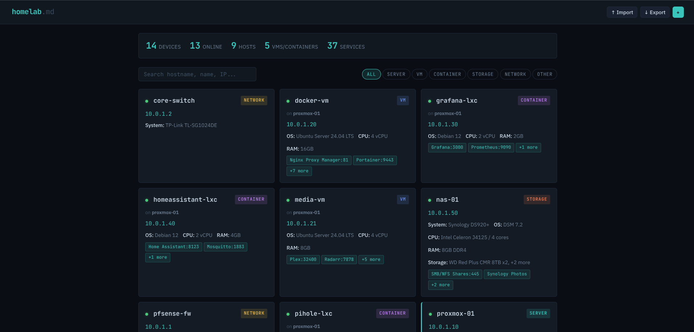

# homelab.md

A single-file, offline-first web app for documenting your homelab infrastructure. Open `index.html` in any browser — no server, no dependencies, no internet required.

## Screenshot

## What It Does

homelab.md gives you a clean interface to catalog every device in your homelab: servers, VMs, LXC containers, network gear, storage, and anything else you're running. It saves everything to a single `homelab.md` Markdown file that you can version with Git, edit in any text editor, or back up however you like.

## Features

- **Full CRUD** — Add, edit, view, and delete devices from the browser UI
- **Parent-child relationships** — Link VMs and containers to their host servers (e.g. LXCs on Proxmox, VMs on TrueNAS)
- **Structured services** — Each device can have multiple services with name, port, notes, and a clickable URL
- **Structured storage** — Track multiple drives per device with type, size, and notes
- **Markdown import/export** — The `homelab.md` file is the source of truth. Import to load, export to save
- **Search and filter** — Filter by device type or search across hostnames, IPs, services, and notes
- **Stats overview** — At-a-glance counts for devices, online status, hosts, VMs/LXCs, and total services
- **Completely offline** — No server, no API calls, no CDN. Just one HTML file

## How To Use

1. Download `index.html` and put it in a folder on your machine
2. Open `index.html` in your browser
3. Click **+** to add your first device
4. Fill in the details — hostname, type, IP, system, OS, CPU, RAM, storage, services, notes
5. For VMs and containers, use the **Host / Parent Device** dropdown to link them to their host
6. Click **↓ Export** to save your data as `homelab.md`

### How Data Is Stored

While you're working, your data lives in the browser's `localStorage`. This means your changes persist between page refreshes and browser restarts without needing to do anything. However, `localStorage` is tied to your browser and can be cleared at any time, so it should not be treated as permanent storage.

The `homelab.md` file is the source of truth. Anytime you make changes through the UI, you should export to save those changes back to the file. If you ever need to ensure your current session matches the file (for example, after editing the `.md` file directly in a text editor, or opening the app in a different browser), click **↑ Import** and select your `homelab.md` file. Importing fully replaces whatever is in `localStorage` with the contents of the file.

### Workflow

The intended workflow is:

1. **Import** your `homelab.md` if you need to sync the UI with the file
2. **Make changes** — add devices, update services, etc.
3. **Export** to save everything back to `homelab.md`
4. **Commit** the file to Git if you want version history

### The Markdown File

The exported `homelab.md` is human-readable Markdown. Each device is an `h1` section with metadata as a bullet list, and services/storage as Markdown tables. You can read it, edit it in any text editor, or render it on GitHub. Parent-child relationships are preserved via IDs in the footer of each device section.

## Device Types

- **Server** — Physical machines (Proxmox hosts, NAS boxes, Raspberry Pis, etc.)
- **Virtual Machine** — VMs running on a host
- **Container / LXC** — Containers running on a host
- **Network Device** — Switches, routers, gateways, access points
- **Storage** — Dedicated NAS or storage appliances
- **Other** — UPS units, KVMs, or anything else

## Requirements

A web browser. That's it.

The app uses Google Fonts for typography (JetBrains Mono and IBM Plex Sans). These will load if you're online, but the app works fine without them — your browser will fall back to system monospace and sans-serif fonts.

## Note

This is a vibe coded app intended to be used completely offline. It was built conversationally with AI and is designed to be simple, practical, and self-contained. No frameworks, no build tools, no node_modules — just a single HTML file you can drop anywhere and open.
