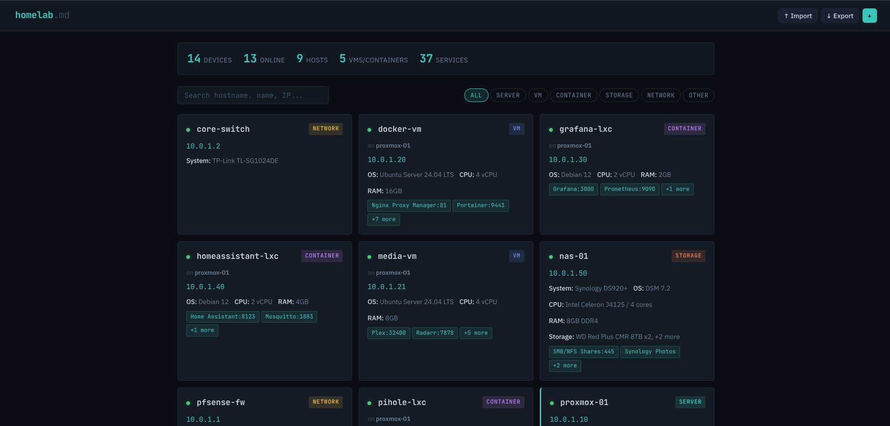

# homelab.md

A single-file, offline-first web app for documenting your homelab infrastructure. Open `index.html` in any browser — no server, no dependencies, no internet required.

## Screenshot

## What It Does

homelab.md gives you a clean interface to catalog every device in your homelab: servers, VMs, LXC containers, network gear, storage, and anything else you're running. It saves everything to a single `homelab.md` Markdown file that you can version with Git, edit in any text editor, or back up however you like.

## Features

- **Full CRUD** — Add, edit, view, and delete devices from the browser UI
- **Parent-child relationships** — Link VMs and containers to their host servers (e.g. LXCs on Proxmox, VMs on TrueNAS)
- **Structured services** — Each device can have multiple services with name, port, notes, and a clickable URL
- **Structured storage** — Track multiple drives per device with type, size, and notes
- **Markdown import/export** — The `homelab.md` file is the source of truth. Import to load, export to save
- **CSV export** — Export your inventory as `homelab.csv` for spreadsheet use, audits, or one-off scripts
- **Public export** — Export a sanitized `homelab-public.md` suitable for sharing publicly, such as on a public-facing website
- **Public HTML export** — Export a sanitized, self-contained `homelab.html` that renders an interactive read-only version of the dashboard, ideal for hosting publicly
- **Unsaved-changes indicator** — A small dot appears on the **↓ Export** button whenever the in-browser data is newer than your last full export, so you don't forget to save changes back to the file
- **Undo on delete** — Deleting a device shows a toast with an **Undo** button (~6 seconds) that fully restores the device and any parent links
- **Safe import** — Importing prompts before replacing existing data and refuses to import a file with no parseable devices, so you can't accidentally wipe your inventory
- **Search and filter** — Filter by device type or search across hostnames, IPs, services, and notes
- **Stats overview** — At-a-glance counts for devices, online status, hosts, VMs/LXCs, and total services
- **Completely offline** — No server, no API calls, no CDN. Just one HTML file

## How To Use

1. Download `index.html` and put it in a folder on your machine
2. Open `index.html` in your browser
3. Click **+** to add your first device
4. Fill in the details — hostname, type, IP, system, OS, CPU, RAM, storage, services, notes
5. For VMs and containers, use the **Host / Parent Device** dropdown to link them to their host
6. Click **↓ Export** and choose **homelab.md Full** to save your data as `homelab.md`

### How Data Is Stored

While you're working, your data lives in the browser's `localStorage`. This means your changes persist between page refreshes and browser restarts without needing to do anything. However, `localStorage` is tied to your browser and can be cleared at any time, so it should not be treated as permanent storage.

The `homelab.md` file is the source of truth. Anytime you make changes through the UI, you should export to save those changes back to the file. A small orange dot appears on the **↓ Export** button whenever the data in your browser is newer than your last full export — a visual nudge so you don't forget. If you ever need to ensure your current session matches the file (for example, after editing the `.md` file directly in a text editor, or opening the app in a different browser), click **↑ Import** and select your `homelab.md` file. Importing fully replaces whatever is in `localStorage` with the contents of the file — when existing data is present, you'll be asked to confirm before it's overwritten, and a file with no parseable devices is rejected so a wrong selection can't wipe your inventory.

### Workflow

The intended workflow is:

1. **Import** your `homelab.md` if you need to sync the UI with the file
2. **Make changes** — add devices, update services, etc.
3. **Export** to save everything back to `homelab.md`
4. **Commit** the file to Git if you want version history

### The Markdown File

The exported `homelab.md` is human-readable Markdown. Each device is an `h1` section with metadata as a bullet list, and services/storage as Markdown tables. You can read it, edit it in any text editor, or render it on GitHub. Parent-child relationships are preserved via IDs in the footer of each device section.

Pipe characters (`|`) and newlines inside service or storage notes are escaped on export (`\|`) and unescaped on import, so a note containing `|` won't break the table or get truncated on re-import.

### CSV Export

The **↓ Export → homelab.csv** option produces a flat `homelab.csv` with one row per device. Multi-value fields (services, storage) are joined with `;` inside a cell. This is intended for spreadsheets, ad-hoc reporting, or feeding the inventory into other tools — it is **not** round-trippable; the `homelab.md` Full export remains the canonical save format.

### Public Export

The **↓ Export → homelab.md Public** option generates a `homelab-public.md` file intended for public use cases such as displaying your homelab on a public-facing website that supports Markdown. It produces a clean, readable summary of your homelab grouped by device type.

Before writing the file, the export automatically removes anything you wouldn't want to share publicly. Removed values are scrubbed (left blank) rather than substituted with a placeholder, and surrounding whitespace and dangling separators are tidied so the output stays readable:

- **IPv4 and IPv6 addresses** — removed (full and compressed IPv6 forms like `2001:db8::1` and `::1` are matched)
- **MAC addresses** — removed
- **Internal/local hostnames** — anything ending in `.lan`, `.local`, `.home.arpa`, `.internal`, `.lab`, or `.home` is removed
- **All URLs and links** — removed (service URLs and anything embedded in notes)
- **Port numbers** — omitted entirely from the services list; mentions like `port 8080` in free-text notes are removed, as are stray `:8080`-style ports left after an IP/URL has been scrubbed
- **Internal metadata** — device IDs, parent IDs, and timestamps are not included

What remains is the hardware and software story of your homelab: device names, types, specs, storage, service names, and any notes you've written — all stripped of anything that could expose your internal network.

### Public HTML Export

The **↓ Export → homelab.html Public** option generates a `homelab.html` file: a single, self-contained HTML page that mirrors the look and interactivity of the homelab.md UI but in a read-only form. Drop it on any static host and you get a live, searchable, filterable dashboard of your homelab.

When you choose this export, you'll be prompted for a **Site Name** that replaces "homelab.md" in the top-left of the exported page (e.g. "My Homelab"). The exported file:

- Uses the same theme and layout as the main app
- Supports search, type filters, and the device detail modal
- Has no add/edit/delete/import/export controls — it's strictly read-only
- Applies the **same sanitization** as the public Markdown export (IPs, MAC addresses, URLs, ports, IDs, and timestamps are removed)
- Is fully offline — no server, no API calls, just one HTML file

## Device Types

- **Server** — Physical machines (Proxmox hosts, NAS boxes, Raspberry Pis, etc.)
- **Virtual Machine** — VMs running on a host
- **Container / LXC** — Containers running on a host
- **Network Device** — Switches, routers, gateways, access points
- **Storage** — Dedicated NAS or storage appliances
- **Other** — UPS units, KVMs, or anything else

## Requirements

A web browser. That's it.

The app uses Google Fonts for typography (JetBrains Mono and IBM Plex Sans). These will load if you're online, but the app works fine without them — your browser will fall back to system monospace and sans-serif fonts.

## AI Disclosure

This project was created with the help of AI.
